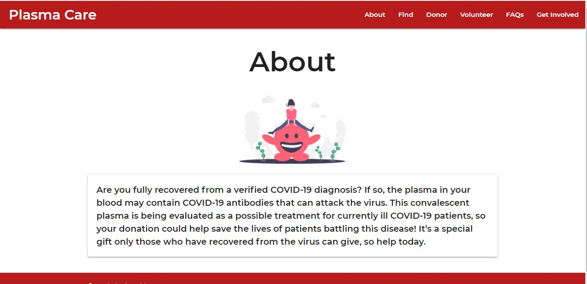

## *__Plasma-Care__* :heart:
*__A web portal to connect plasma donors to those in need of it.__*  
Plasma therapy is a treatment where the plasma (the straw-coloured, liquid component of blood that acts as a transporting medium) 
from a recovered patient is injected in the body of an infected patient. It has been observed that the antibodies
present in the recovered patient’s blood neutralise the virus present in the COVID patient’s body.
Thus, the treatment is being suggested for patients who are moderately affected by the virus. Plasma can be donated once in 14 days.  

*__It has been observed that several patients who were in need of plasma for treatment, were unable to get it, the reason was not that it was not available, but they were unable to find the required donor__*  

Thus, <strong>Plasma Care</strong> is a solution to ensure that patients in need of plasma can connect directly with recovered patients, proper care would be taken to ensure complete security of communication.  
After registration, the donors can fill a simple form to make themselves available for plasma donation. Along with their location.  
The patients in need of plasma can directly connect with the donors. This would ensure that the time taken to find donors is minimized.  

*__In any crisis citizens have an important role to play towards the wellbeing of the society__*  
The citizens could register as volunteers and make themselves available to provide services to the needy when required  

There is also an about and FAQ page, which helps in spreading awareness about plasma donation.

### *__Running the Project__* :running:

* Install Python
* Clone the repository
* Go to the root folder
* Install Django `pip install django`
* Run the server `python manage.py runserver`
* View it on http://127.0.0.1:8000  

<strong>For Advanced users</strong>
* Make a virtual environment
* Install Django
* Run the server `python manage.py runserver`
* View on http://127.0.0.1:8000

